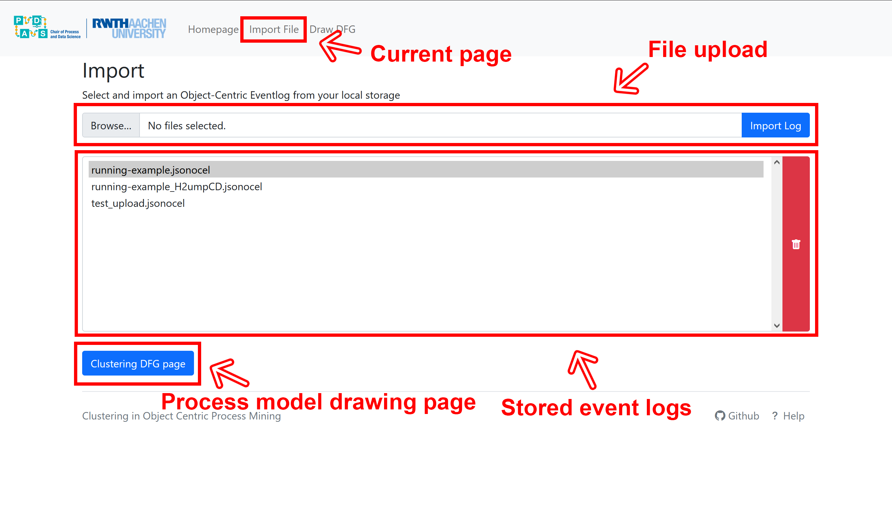
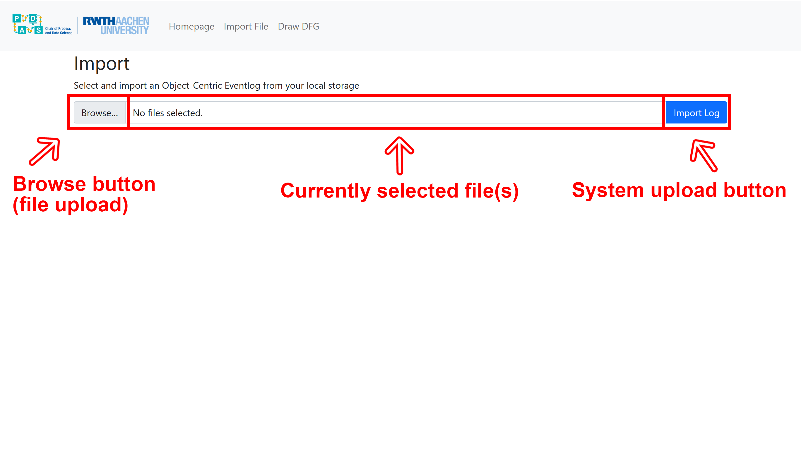
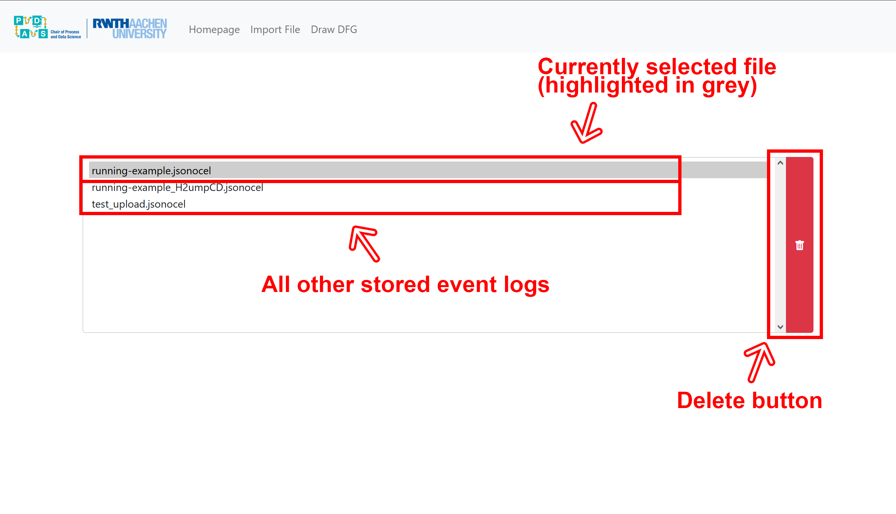
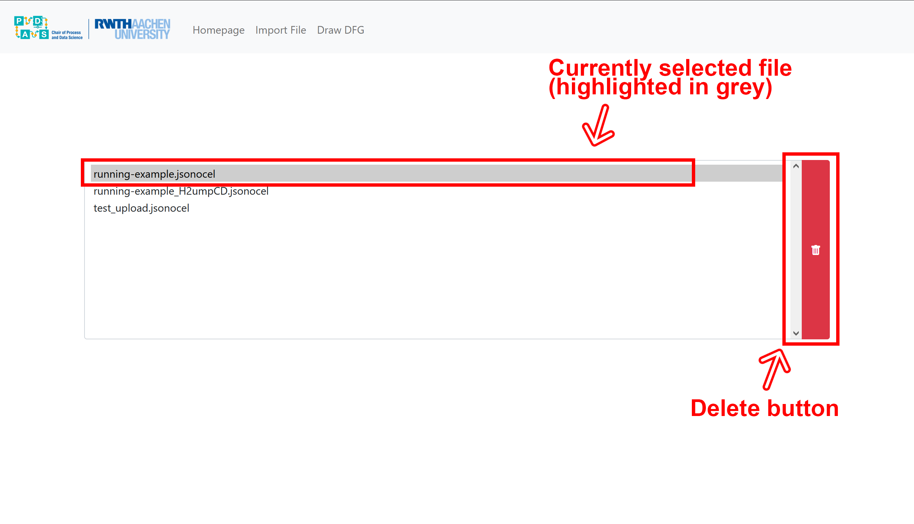
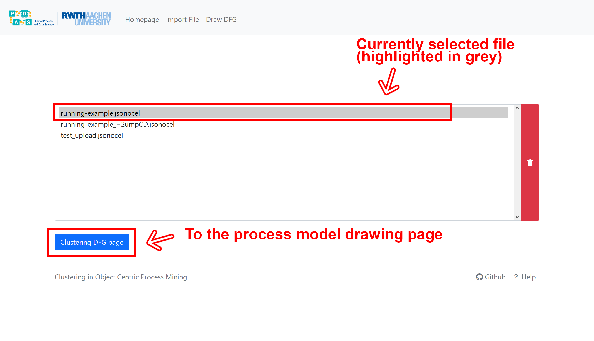
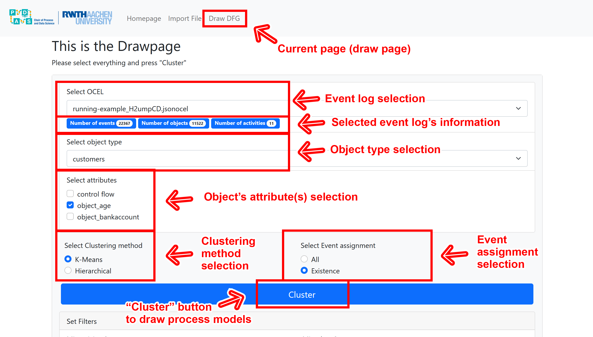
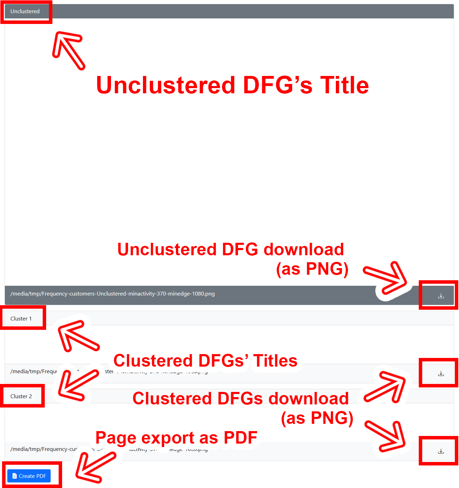

 

# Clustering in Object Centric Process Mining: User Manual

 

## Project Initiation

### Requirements Overview

 

* Requires Python, pip and Graphviz.
* Requires Docker for the creation of a container, which may be downloaded here: https://docs.docker.com/docker-for-windows/install/.

### Initialisation

 

* Firstly, clone the project from https://github.com/Justus-Nitroklaus/Clustering-in-Object-Centric-Process-Mining.git.
* After cloning to your local, run the command `pip install -r requirements.txt` to download all requirements.

### Running without a Container

 

* Run the command `python manage.py runserver` in the project directory in order to run the development server at `http://127.0.0.1:8000/`.
* Type `http://127.0.0.1:8000/` into your browser and you should be able to run the project.

### Creating & Running a Docker Container

 

* Run the command `docker build . -t [image_name]` with `[image_name]` being whatever name you want to give the image. For example: `docker build . -t ciocel_one`. This should build a Docker image with the passed name.
* Run the Docker container that you have created using the command `docker run -d -p 8000:8000 [image_name]`, while replacing `[image_name]` with the name you have previously given the image. That should run the container in detached mode and port it to your local host; `http://127.0.0.1:8000/`.
* Type `http://127.0.0.1:8000/` into your browser and you should be able to run the project.

 

## Understanding the Application Layout

* The home page, like all other pages, includes a navigation bar at the top. 
* The navigation bar includes three pages: the home page, which you are currently on, the file import page, and the DFG drawing page.
* To begin, click on "Import File", which should land you in the file import page.

 

## Uploading an Object-Centric Event Log

* After you have landed in the file import page, this should be your view; here you will see a functionality to upload event logs, a storage of all previously imported event logs, and a button that brings you to the DFG drawing page.

* Using the browse button, you can pick and then upload OCEL-standard files formatted as XML or JSON.
* After selecting your files, you are able to see the names and directories of the selected files.
* After making sure that you have selected the files you want to work with, press the "Import Log" button. That shoud upload your files to the database for use.

* In the storage view, you are able to view which files you have previously uploaded. 
* The selected file is highlighted in grey, and can even be removed from the saved files.

 

## Deleting an Event Log

* Should you ever want to remove an event log from the system, simply head to the storage, select the event log, then press on the red delete button.

 

## Generating Clusters and a Process Model for the Object-Centric Event Log

### Going from the Import Page to the Draw Page

 

* In order to start creating clusters and viewing the cluster process models, press on the "Cluster DFG page" button. That button should lead you to the drawing page.

### Drawing the Clusters and the Main Process Model

 

#### Event Log Selection

 

* Having landed in the draw page, you are now able to simply press on the dropdown menu and select one of your previously uploaded event logs.

#### Object Type Selection

 

* Following the selection of an event log, you are able to select an object type by pressing on the dropdown menu right below it.

#### Selecting the Object's Attributes

 

* By click on the boxes, you are able to select one or more object attributes that you would like your clusters to be centered around.

#### Selecting a Clustering Method

 

* The last step ist to select a clustering method (4) and the method how to assign events to the clusters (5).
* If you choose "All" event assignment, an event is just assigned to a cluster if ALL objects in that event are in that cluster.
* If you choose "Existence" event assignment, an event is assigned to a cluster as soon as AT LEAST ONE object from the event is in the cluster

#### Drawing the Process Model DFGs

 

* Simply press the "Cluster" button!

#### Filtering your Selections

 

* You can set the minimum number of activities (1) and the minimal number of edges (2), both in a range of zero to 5000.
* After the filters have been set, you need to press the "Filter" button (3).
* Filtering of a cluster can be done repeatedly, even after the creation of a cluster. Just make sure to change the ranges and then press the "Filter" button.

 

## Exporting the Clustered & Unclustered Process Models

* Following the drawing of the DFGs, you are able to see both the main, unclustered process model at the top (named "Unclustered"), as well as all cluster process models below that (named "Cluster n" with n denoting a simple enumeration). 
* You can download the DFG for each process model separately as a PNG by using the download button right below the DFG on the right hand corner.
* If you would like, you also have the possibility of downloading the whole thing, including all DFGs, as a PDF by simply clicking the "Create PDF" button at the very bottom.

 

